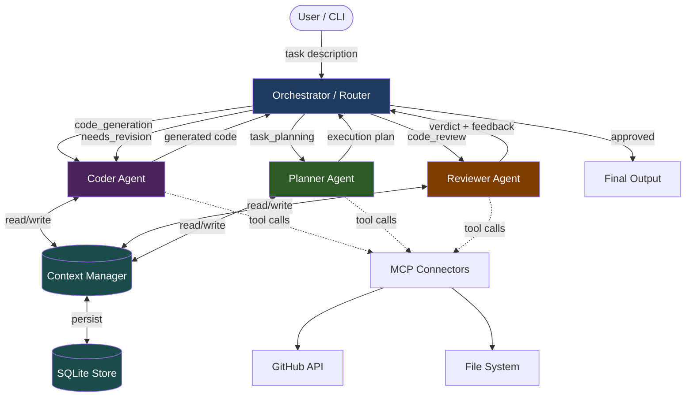

# CodeOps Agent

> A multi-agent dev workflow automation system powered by **Claude** (Anthropic) that orchestrates specialised AI agents to automate software engineering tasks — from planning to code generation, review, and self-correction.

[](https://www.python.org/downloads/)
[](https://www.anthropic.com/)
[]()
[](LICENSE)

---

## What It Does

Give CodeOps Agent a task — a GitHub issue, feature spec, or plain-English description — and it:

1. **Plans** the work into a structured, dependency-aware execution plan
2. **Codes** each step with a production-focused Coder agent
3. **Reviews** the output with a Reviewer agent that scores quality, flags bugs, and identifies security issues
4. **Self-corrects** by routing reviewer feedback back to the Coder (up to *N* iterations)
5. **Persists** everything — plans, code artifacts, agent outputs — to SQLite for cross-session memory

```
$ codeops run "Build a thread-safe rate limiter in Python" --demo

╭──────────────────────────────────────────────────────╮
│ [DEMO] CodeOps Agent v0.1.0                          │
│ Model: claude-sonnet-4-6                             │
│                                                      │
│ Build a thread-safe rate limiter in Python            │
╰──────────────────────────────────────────────────────╯

  ✓ planner → success
  ✓ coder → success
  ⚠ reviewer → needs_revision (score 6/10)
  ↻ Revision needed — iteration 2/3
  ✓ coder → success (addressed feedback)
  ✓ reviewer → approved (score 9/10)

Pipeline complete — SUCCESS in 2 iteration(s)
```

---

## Architecture



---

## Quick Start

### Option 1: Demo Mode (no API key needed)

```bash
git clone https://github.com/Saajine/codeops-agent.git
cd codeops-agent
pip install -r requirements.txt
pip install -e .

# Run the full pipeline with realistic mock responses
codeops run "Build a rate limiter in Python" --demo
```

### Option 2: Live Mode (with Anthropic API key)

```bash
cp .env.example .env
# Edit .env and add: ANTHROPIC_API_KEY=sk-ant-...

codeops run "Build a rate limiter in Python"
```

---

## CLI Commands

```bash
# Full pipeline: plan → code → review → self-correct
codeops run "Build a Redis-backed session store" --demo

# Just generate an execution plan
codeops plan "Add authentication to the API" --demo

# Run code review only
codeops review "Review this Flask app for security issues" --demo

# List all registered skills (active + roadmap)
codeops skills

# View task history from SQLite
codeops history

# Check version and config
codeops version
```

### CLI Options

| Flag | Description |
|------|-------------|
| `--demo` / `-d` | Run in demo mode (no API key needed) |
| `--model` / `-m` | Override Claude model (default: `claude-sonnet-4-6`) |
| `--max-iter` / `-i` | Max self-correction iterations (default: 3) |
| `--output` / `-o` | Directory to write generated code files |

---

## How It Works

### The Agent Loop

```
User Task
    │
    ▼
┌─────────────────────────────────────────────────────┐
│  ORCHESTRATOR                                        │
│                                                      │
│  1. Planner  →  structured JSON execution plan       │
│                                                      │
│  For each step in plan:                              │
│    2. Coder    →  generates code files               │
│    3. Reviewer →  scores + structured feedback       │
│       │                                              │
│       ├── approved (score ≥ 7)  →  next step         │
│       └── rejected (score < 7)  →  back to Coder    │
│                                                      │
│  4. Persist everything to SQLite                     │
└─────────────────────────────────────────────────────┘
    │
    ▼
Final Output (code + review report + plan)
```

### Self-Correction Loop

The Reviewer returns a **structured JSON verdict** (score 1-10, issue list, severity levels). When `score < 7` or critical/major issues exist, the Orchestrator routes back to the Coder with the full feedback. This continues for up to `CODEOPS_MAX_ITERATIONS` (default: 3).

### Shared Context

All agents share a `ContextManager` instance per task:
- Planner writes the execution plan
- Coder reads the plan and writes generated code
- Reviewer reads the code and writes its verdict
- On retry, Coder reads the reviewer's feedback

The context is persisted as JSON after every update, enabling session resumption.

---

## Tech Stack

| Component        | Technology                              |
|------------------|-----------------------------------------|
| LLM              | Anthropic Claude Sonnet 4.6 with adaptive thinking |
| Streaming        | Anthropic Python SDK (`messages.stream`) |
| Orchestration    | Custom Python orchestrator with skill-based routing |
| Persistence      | SQLite via stdlib `sqlite3`             |
| External Tools   | MCP protocol — GitHub REST API, filesystem |
| CLI              | Typer + Rich (progress bars, syntax highlighting, tables) |
| Testing          | pytest + pytest-mock (41 tests)         |

---

## Python API

```python
from codeops.orchestrator import Orchestrator

# Full pipeline: plan → code → review
orchestrator = Orchestrator(max_iterations=3)
result = orchestrator.run("""
    Feature: Add rate limiting middleware to a FastAPI application.
    - Token bucket algorithm, configurable per-route limits
    - Redis-backed for horizontal scaling
    - Returns 429 with Retry-After header when limit exceeded
""")

print(f"Status: {result.status}")
print(f"Plan: {result.plan['title']}")
print(result.final_output)

# Run a single skill directly
result = orchestrator.run_single_skill("code_review", my_code_string)
```

### Using Individual Agents

```python
from codeops.agents import PlannerAgent, CoderAgent, ReviewerAgent
from codeops.memory.context import ContextManager

context = ContextManager()
context.set_task("Build a cache module")

planner = PlannerAgent()
plan_result = planner.execute("Build a thread-safe LRU cache", context)

coder = CoderAgent()
code_result = coder.execute("Implement LRU cache with TTL", context)

reviewer = ReviewerAgent()
review_result = reviewer.execute("Review the cache implementation", context)

print(f"Review verdict: {review_result.metadata['verdict']}")
print(f"Score: {review_result.metadata['score']}/10")
```

---

## Skills Framework

Skills are the routing contracts between tasks and agents. Adding a new agent is three steps:

### Step 1: Define the skill

```python
# codeops/skills/definitions.py
SKILL_SECURITY_AUDIT = SkillDefinition(
    name="security_audit",
    agent="security",
    description="Audit code for OWASP top 10, auth issues, injection flaws.",
    tags=["security", "audit", "owasp", "vuln"],
    priority=35,
)
```

### Step 2: Build the agent

```python
# codeops/agents/security_auditor.py
class SecurityAuditorAgent(BaseAgent):
    name = "security"
    skills = ["security_audit"]
    system_prompt = "You are a security expert specialising in code auditing..."

    def execute(self, task: str, context: ContextManager) -> AgentResult:
        messages = [{"role": "user", "content": task}]
        output = self._call_llm(messages)
        return AgentResult(
            agent_name=self.name, skill="security_audit",
            output=output, status="success", next_action="done",
        )
```

### Step 3: Register in the Orchestrator

```python
# codeops/orchestrator.py  _init_agents()
from codeops.agents.security_auditor import SecurityAuditorAgent
self._agents["security"] = SecurityAuditorAgent(store=self.store)
```

That's it. The orchestrator will now route any step with `skill: "security_audit"` to your new agent.

---

## Running Tests

```bash
# All tests (no API key needed — all LLM calls are mocked)
pytest -v

# Specific test file
pytest tests/test_agents.py -v
pytest tests/test_orchestrator.py -v
pytest tests/test_skills.py -v
```

---

## Project Structure

```
codeops-agent/
├── README.md
├── requirements.txt
├── setup.py
├── pytest.ini
├── .env.example
│
├── codeops/
│   ├── __init__.py
│   ├── cli.py               # Typer CLI — run, plan, review, skills, history
│   ├── config.py             # Environment-based configuration
│   ├── demo.py               # Demo mode — realistic mock responses
│   ├── orchestrator.py       # Main router + self-correction loop
│   │
│   ├── agents/
│   │   ├── base_agent.py     # Abstract base: execute(), _call_llm(), streaming
│   │   ├── planner.py        # PlannerAgent  → structured JSON execution plans
│   │   ├── coder.py          # CoderAgent    → production code generation
│   │   ├── reviewer.py       # ReviewerAgent → structured code review + scoring
│   │   ├── github_pr.py      # GitHubPRAgent → PR automation + risk assessment
│   │   └── architecture_advisor.py  # ArchitectureAdvisorAgent → system design review
│   │
│   ├── skills/
│   │   ├── definitions.py    # SkillDefinition dataclasses (6 active + 6 roadmap)
│   │   └── registry.py       # SkillRegistry — keyword routing + agent binding
│   │
│   ├── memory/
│   │   ├── context.py        # ContextManager — shared in-memory state per task
│   │   └── store.py          # MemoryStore    — SQLite persistence layer
│   │
│   └── mcp/
│       └── connectors.py     # GitHubConnector, FileSystemConnector, CICDConnector
│
├── examples/
│   ├── feature_build.py      # Demo: full Planner → Coder → Reviewer pipeline
│   ├── pr_review.py          # Demo: review a PR or local file
│   ├── pr_automation.py      # Demo: PR description + risk assessment
│   ├── architecture_review.py # Demo: system design analysis
│   └── incident_triage.py    # Demo: analyse logs and generate remediation
│
└── tests/
    ├── test_agents.py         # Unit tests for all agents (mocked LLM)
    ├── test_orchestrator.py   # Integration tests for full pipeline
    └── test_skills.py         # Registry and SkillDefinition tests
```

---

## Environment Variables

```bash
# Required (unless using --demo mode)
ANTHROPIC_API_KEY=sk-ant-...

# Optional
GITHUB_TOKEN=ghp_...                # For PR review features
CODEOPS_MODEL=claude-sonnet-4-6     # LLM model (default: claude-sonnet-4-6)
CODEOPS_MAX_ITERATIONS=3            # Self-correction loop limit
CODEOPS_MAX_TOKENS=16000            # Max tokens per LLM call
CODEOPS_DEMO=1                      # Enable demo mode globally
```

---

## Roadmap

| Agent | Skill | Use Case |
|-------|-------|----------|
| **Test Generator** | `test_generation` | Auto-generate pytest/jest test suites from code changes |
| **Docs Agent** | `doc_generation` | Generate runbooks, API docs, changelogs from diffs |
| **Incident Triage** | `incident_triage` | Summarise logs, isolate failures, propose hotfixes |
| **Pipeline Optimizer** | `pipeline_optimizer` | Profile Spark/dbt pipelines, recommend optimisations |
| **Legacy Migrator** | `legacy_migration` | Convert SQL to PySpark, Python 2 to 3, REST to GraphQL |
| **Data Quality** | `data_quality` | Schema drift detection, null spike alerts, reconciliation |

All roadmap agents are already registered in the skill system — implementing one means writing a single Python class.

---

## Key Design Decisions

**Why skill-based routing?**
Skills decouple task requirements from agent implementations. The orchestrator never hard-codes "send this to ReviewerAgent" — it asks the registry "which agent handles `code_review`?". Adding a new agent is a three-line change.

**Why adaptive thinking?**
All agents use `thinking: {"type": "adaptive"}` which lets Claude decide how deeply to reason per request — thorough analysis for complex planning, lighter touch for simple tasks.

**Why streaming?**
All LLM calls use the streaming API. This prevents HTTP timeouts on long code-generation tasks and enables real-time progress display.

**Why SQLite?**
Zero infrastructure — works locally and in CI. The schema is simple and the store is easily swapped for Postgres in production.

**Why demo mode?**
The full agent loop (plan, code, review, self-correct) runs with realistic mock responses so you can see the architecture in action without an API key or spending credits.

---

## Author

**Saajine Sathappan** — MS Computer Science, University of Wisconsin-Madison

---

## License

MIT — see [LICENSE](LICENSE)
